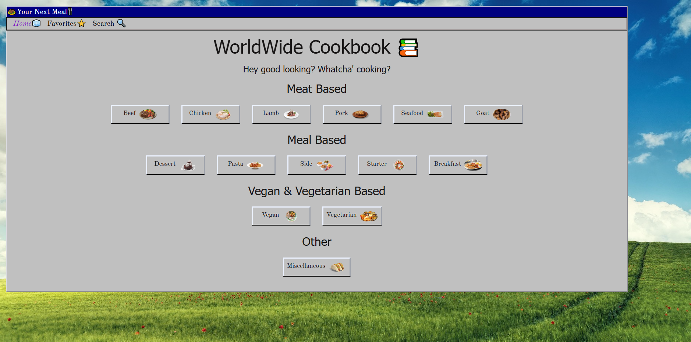
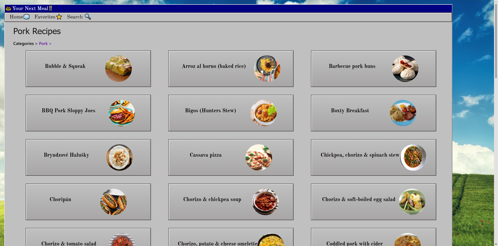
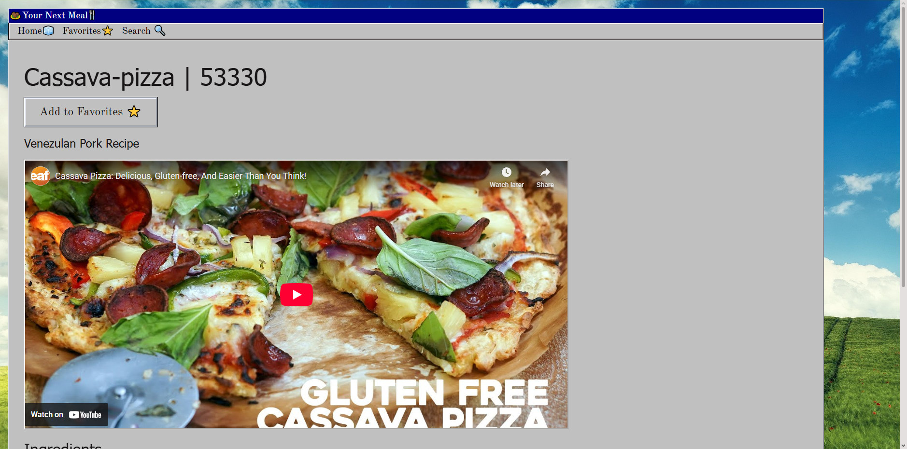
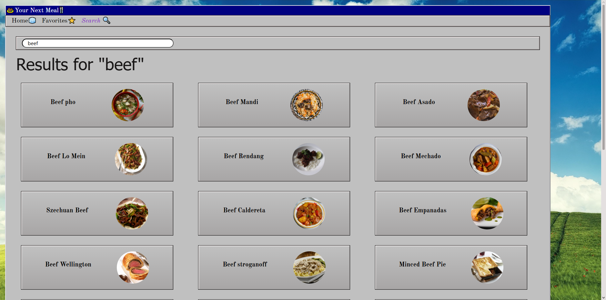

# 🧆 Your Next Meal 🍴 Application
## Module 10 Recipe Discovery App | SBA Overview
The purpose of this project is to serve as a comprehensive demonstration of my mastery of advanced React concepts. This lab is focused on:

- State Management
- Data Fetching
- Custom Hooks
- Global State with the Context API
- Routing
- Utilizing Reusuable Components and creating appealing UI.

Users should be able to:

- Browse Recipes by Category
- Search for specific recipes
- View detailed recipe information
- Manage a personal list of favorite recipes.

------------------------------------------------
## Table of contents

- [Overview](#overview)
  - [GitHub](#github)
  - [How To Use](#how-to-use)
  - [My process](#my-process)
  - [Built with](#built-with)
  - [Reflection Questions](#reflection-questions)
  - [Useful resources](#useful-resources)
- [Author](#author)

### GitHub Link
https://github.com/ANIO-Official/your-next-meal-app

### How To Use
1.  Clone the repository or Download the ZIP file and extract the files.
2.  Open the file in Visual Studio Code.
3.  Open the Terminal using Ctrl + ~
4.  cd into the directory 'your-next-meal-app' in the terminal.

    **Ensure NPM is is installed for the project to run:** 

      inside the terminal window run npm i to install npm

5.  (Once NPM is indeed installed in the project file directory, you'll see a node modules folder) Run the project using "npm run dev" in the terminal.
6.  You should see 3 options appear. Follow the link for the Local option. Such as "http://localhost:5173/"

A web app in your default browser will appear with the todo list app available for use:

- Click through the Homepage to explore different meal categories. Or use the main nav to navigate to Home, Favorites, and the Search page.
- Click through a Category's page to check out different recipes among it.
- View a Recipe's Detail page with information such as ingredients, instructions, it's area of origin, and a youtube video when available.
- Go back at anytime using the back button at the bottom of the page.
- Search for recipes in the Search page.

*Feel free to reference the Overview for a reminder of interactions that should be present.*

## My process

  Steps brief about process:

 1. Build HTML and Starter CSS with Bootstrap Librarys
 2. Code the elements via JSX & React. Using semantics where possible.
 3. Run Tests using npm run dev.
 4. Bug Fix using Google Developer tools, Removals of unnecessary code, Reusing and Refactoring components and old code from previous projects where applicable.
 5. Visual Design Changes to ensure the final product passes the accessibility contrast test.

### Built with

- React
- JSX
- Vue
- Javascript
- Bootstrap
- CSS

## Reflection

 **Main Challenges**

 **Design Decisions**

  

### Useful resources

**MDN Documentation**

[MDN String.includes()](https://developer.mozilla.org/en-US/docs/Web/JavaScript/Reference/Global_Objects/String/includes)

[MDN Array.includes()](https://developer.mozilla.org/en-US/docs/Web/JavaScript/Reference/Global_Objects/Array/includes)

[MDN Array.split()](https://developer.mozilla.org/en-US/docs/Web/JavaScript/Reference/Global_Objects/String/split)

[MDN Property Accessors](https://developer.mozilla.org/en-US/docs/Web/JavaScript/Reference/Operators/Property_accessors)

[MDN Object.keys(object)](https://developer.mozilla.org/en-US/docs/Web/JavaScript/Reference/Global_Objects/Object/keys)

**Embedding Youtube Videos When provided with watch URL**

[W3Schools html Youtube Video](https://www.w3schools.com/html/html_youtube.asp)

["Cool IT Help" | Error fixed "www.youtube.com refused to connect" when trying to embed video](https://www.youtube.com/watch?v=nqO6cEbXyKM)

**Styling Documentation**

https://fonts.google.com/ - For OFL fonts. 

[Theme Reference for OldSchool Inspiration](https://www.webdesignmuseum.org/software/netscape-navigator-2-0-in-1995)

**React Router with Codevolution**

[Codevolution Rect Router Playlist](https://www.youtube.com/playlist?list=PLC3y8-rFHvwjkxt8TOteFdT_YmzwpBlrG) - Assissted in refreshers about the React Router Declarative method.

**Meals API Links & Documentation**

[API Docs](https://www.themealdb.com/api.php)

[API All Categories](https://www.themealdb.com/api/json/v1/1/categories.php)

[API Category Filter Example 'Seafood'](https://www.themealdb.com/api/json/v1/1/filter.php?c=Seafood)

[API Return Recipe by ID](https://www.themealdb.com/api/json/v1/1/lookup.php?i=52772)

[API Search by Name Example 'beef'](https://www.themealdb.com/api/json/v1/1/search.php?s=beef)

**React Router Docs**

[useNavigate](https://reactrouter.com/api/hooks/useNavigate)

[Method/Mode Differences](https://reactrouter.com/start/modes)

**Reused Code / Referenced Previous Code**

[Where in the World | Searchbar Functionality](https://github.com/ANIO-Official/where-in-the-world/blob/main/where-in-the-world-main/index.js#L505)

[Input Change Event | Refactored from TS to JS for this project](https://github.com/ANIO-Official/context-api-implementation/blob/main/src/components/TodoInput/TodoInput.tsx)

## Author

- LinkedIn - [Amanda Ogletree](https://www.linkedin.com/in/amanda-ogletree-a61b60168)